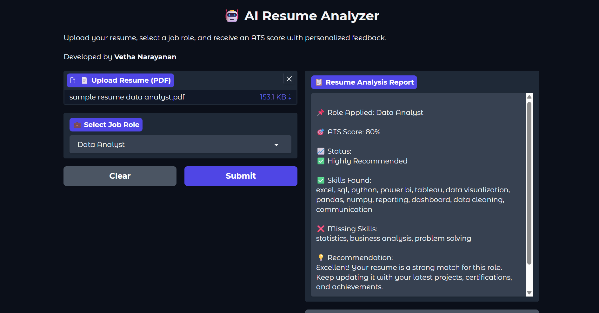

# 🚀 AI Resume Analyzer

> An Intelligent ATS-Based Resume Screening System built using Python, Gradio, and Render.

---

## 🌐 Live Demo

🔗 **Application:** https://resume-analyzer-v6la.onrender.com

📂 **GitHub Repository:** https://github.com/GVethaNarayanan/Resume-Analyzer

---

## 📸 Application Preview


---

## 📌 Overview

AI Resume Analyzer is a smart ATS (Applicant Tracking System) based web application that automates the initial resume screening process. Users can upload their resume, select a target job role, and instantly receive an ATS score, matched skills, missing skills, and personalized recommendations.

The application supports multiple job roles and provides a simple, interactive interface for evaluating resumes.

---

## 🎯 Problem Statement

Recruiters often receive hundreds of resumes for a single job opening. Manually reviewing every resume is time-consuming, error-prone, and inconsistent.

This project helps by:

- ✅ Automating resume screening
- ✅ Matching candidate skills with job requirements
- ✅ Calculating ATS scores
- ✅ Identifying missing skills
- ✅ Providing personalized recommendations

---

## ✨ Features

- 📄 Upload Resume (PDF)
- 🔍 Automatic Resume Text Extraction
- 🧠 Skill-Based Resume Analysis
- 📊 ATS Score Calculation
- ✅ Skills Matched Detection
- ❌ Missing Skills Identification
- 💡 Personalized Recommendations
- 🌐 Interactive Gradio Web Interface
- ☁️ Cloud Deployment using Render
- 📈 Multiple Job Role Support

---

## 🛠️ Technologies Used

### Programming Language

- Python

### Libraries

- Gradio
- PDFPlumber
- JSON

### Deployment

- Render

### Development Tools

- Git
- GitHub

---

## ⚙️ System Workflow

```text
Resume Upload
      │
      ▼
PDF Text Extraction
      │
      ▼
Skill Detection
      │
      ▼
Skill Matching
      │
      ▼
ATS Score Calculation
      │
      ▼
Missing Skill Analysis
      │
      ▼
Recommendation Generation
      │
      ▼
Resume Analysis Report
```

---

## 📊 ATS Evaluation Criteria

The ATS score is calculated based on the percentage of required skills found in the uploaded resume.

| ATS Score | Recommendation |
|-----------|----------------|
| 🟢 80% - 100% | Highly Recommended |
| 🟡 60% - 79% | Recommended |
| 🔴 Below 60% | Not Eligible |

---

## 📂 Project Structure

```text
Resume-Analyzer/
│
├── app.py
├── jobs.json
├── requirements.txt
├── README.md
└── sample resumes/
```

---

## 🚀 How to Run Locally

### Clone the repository

```bash
git clone https://github.com/GVethaNarayanan/Resume-Analyzer.git
```

### Install dependencies

```bash
pip install -r requirements.txt
```

### Run the application

```bash
python app.py
```

Open your browser and visit:

```
http://127.0.0.1:7860
```

---

## 🎓 Learning Outcomes

This project helped explore:

- MLOps Fundamentals
- Git & GitHub
- Resume Parsing
- ATS Evaluation Systems
- Skill Matching Algorithms
- Python Web Application Development
- Cloud Deployment with Render

---

## 🔮 Future Enhancements

- 🤖 AI-Powered Resume Classification
- 📑 NLP-Based Skill Extraction
- 🏆 Resume Ranking System
- 📊 Recruiter Dashboard
- 🐳 Docker Support
- ⚡ CI/CD Pipeline
- ☁️ Multi-Cloud Deployment
- 📈 Advanced Resume Analytics
- 🔄 Additional Job Roles
- 📁 DOCX Resume Support

---

## 👨‍💻 Author

**Vetha Narayanan**

🎓 B.Tech Information Technology  
📍 Chennai Institute of Technology

---

## ⭐ Support

If you found this project useful, please consider giving this repository a ⭐ on GitHub.

It helps others discover the project and supports future improvements.
